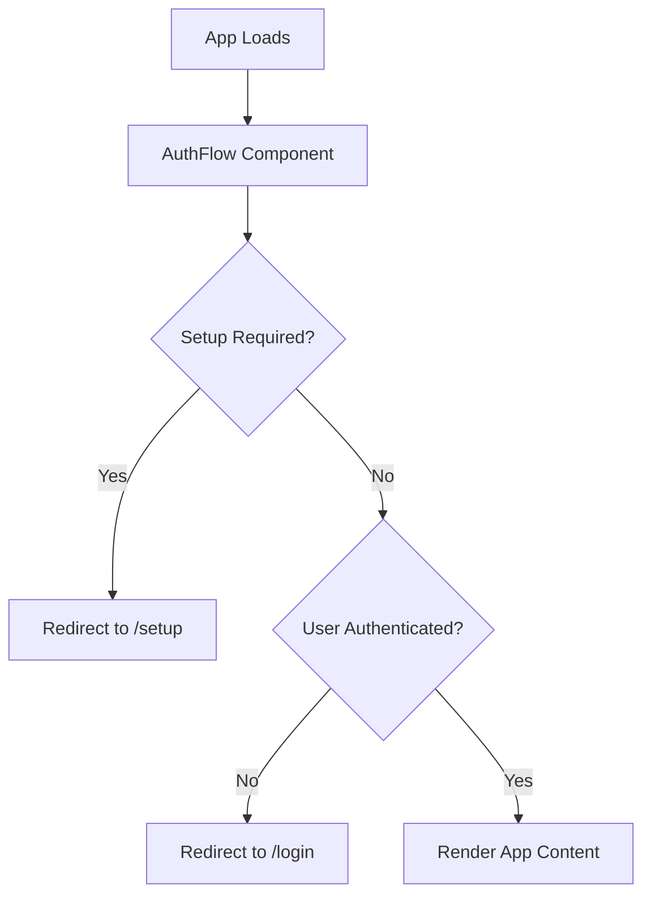
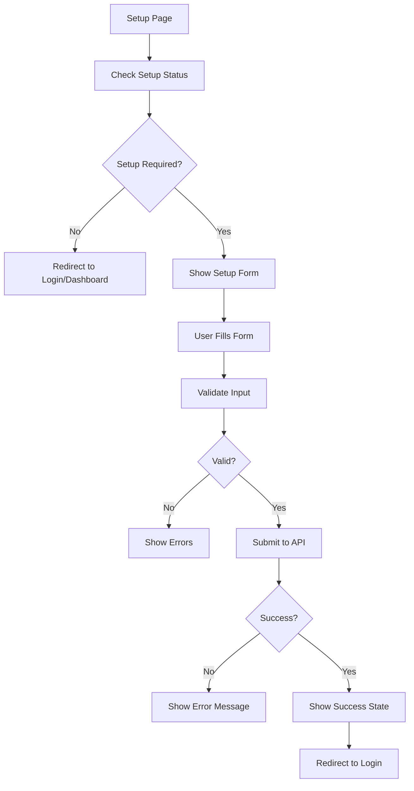
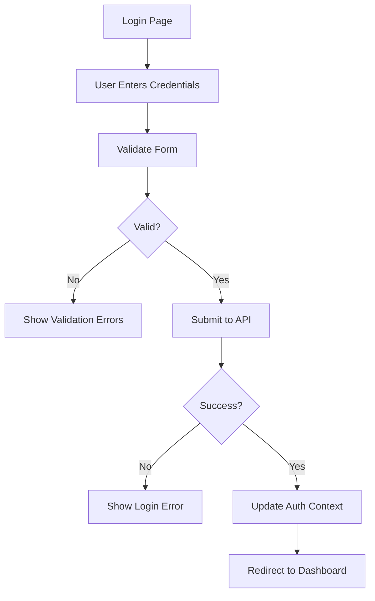
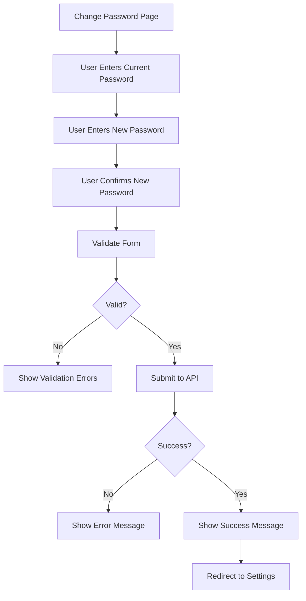

# Authentication Flow Documentation

This document describes the complete authentication flow implementation for the Minecraft Server Manager frontend.

## Overview

The authentication system provides a secure, user-friendly flow for user authentication, account setup, and password management. It integrates with the Flask backend API and provides a seamless experience across the application.

## Components

### Core Components

#### AuthFlow
The main authentication flow controller that handles initial setup checks and routing.

**Features:**
- Automatic setup status detection
- Authentication state management
- Route protection and redirection
- Loading state handling
- Error handling and fallbacks

**Usage:**
```tsx
import AuthFlow from './components/auth/AuthFlow';

<AuthFlow>
  <AppContent />
</AuthFlow>
```

#### LoginForm
Comprehensive login form with validation and security features.

**Features:**
- Real-time form validation
- Password visibility toggle
- Loading states
- Error handling
- Accessibility support
- Integration with AuthContext

**Props:**
- `onSuccess?: () => void` - Callback for successful login
- `onError?: (error: string) => void` - Callback for login errors

#### SetupForm
Initial admin account setup form for first-time installation.

**Features:**
- Multi-field validation
- Password strength indicators
- Email validation (optional)
- Real-time feedback
- Security requirements
- Integration with setup API

**Props:**
- `onSuccess?: (user: User) => void` - Callback for successful setup
- `onError?: (error: string) => void` - Callback for setup errors

#### ChangePasswordForm
Secure password change form with validation.

**Features:**
- Current password verification
- New password validation
- Password confirmation
- Security requirements
- Real-time feedback
- Integration with change password API

**Props:**
- `onSuccess?: () => void` - Callback for successful password change
- `onError?: (error: string) => void` - Callback for password change errors
- `onCancel?: () => void` - Callback for form cancellation

### Pages

#### LoginPage
Main login page with branding and form integration.

**Features:**
- Minecraft-themed branding
- Responsive design
- Automatic redirection for authenticated users
- Integration with AuthLayout

#### SetupPage
Initial setup page for admin account creation.

**Features:**
- Setup status checking
- Success state handling
- Automatic redirection
- Integration with SetupForm
- Loading states

#### ChangePasswordPage
Dedicated page for password changes.

**Features:**
- Full-page layout
- Navigation breadcrumbs
- Integration with ChangePasswordForm
- Success/cancel handling

## Authentication Flow

### 1. Initial Application Load



### 2. Setup Flow



### 3. Login Flow



### 4. Password Change Flow



## API Integration

### Authentication Endpoints

#### Login
```typescript
POST /api/v1/auth/login
{
  "username": "string",
  "password": "string"
}

Response:
{
  "success": true,
  "message": "Login successful",
  "user": {
    "id": 1,
    "username": "admin",
    "is_admin": true,
    "email": "admin@example.com",
    "is_active": true,
    "last_login": "2024-12-19T10:30:00Z"
  }
}
```

#### Logout
```typescript
POST /api/v1/auth/logout

Response:
{
  "success": true,
  "message": "Logout successful"
}
```

#### Get Current User
```typescript
GET /api/v1/auth/me

Response:
{
  "success": true,
  "user": {
    "id": 1,
    "username": "admin",
    "is_admin": true,
    "server_count": 3,
    "total_memory_allocated": 3072
  }
}
```

#### Check Auth Status
```typescript
GET /api/v1/auth/status

Response:
{
  "authenticated": true,
  "user": {
    "id": 1,
    "username": "admin",
    "is_admin": true
  }
}
```

#### Setup Admin
```typescript
POST /api/v1/auth/setup
{
  "username": "admin",
  "password": "securepassword",
  "confirm_password": "securepassword",
  "email": "admin@example.com"
}

Response:
{
  "success": true,
  "message": "Admin account created successfully",
  "user": {
    "id": 1,
    "username": "admin",
    "is_admin": true
  }
}
```

#### Check Setup Status
```typescript
GET /api/v1/auth/setup/status

Response:
{
  "setup_required": true,
  "has_admin": false
}
```

#### Change Password
```typescript
POST /api/v1/auth/change-password
{
  "current_password": "oldpassword",
  "new_password": "newpassword"
}

Response:
{
  "success": true,
  "message": "Password changed successfully"
}
```

## Security Features

### Password Requirements
- Minimum 8 characters
- At least one uppercase letter
- At least one lowercase letter
- At least one number
- Cannot contain username

### Rate Limiting
- Login attempts: 5 attempts per 5 minutes per username
- Automatic lockout after exceeding limits
- Progressive backoff for repeated failures

### Session Management
- Secure session cookies
- CSRF protection
- Automatic session validation
- Secure logout with session cleanup

### Input Validation
- Client-side validation for immediate feedback
- Server-side validation for security
- Input sanitization
- XSS protection

## Error Handling

### Client-Side Errors
- Form validation errors
- Network connectivity issues
- API response errors
- Authentication failures

### Server-Side Errors
- Invalid credentials
- Account locked/disabled
- Rate limiting exceeded
- Server errors (500)

### Error Recovery
- Automatic retry for network errors
- Clear error messages
- Fallback to safe states
- User guidance for resolution

## Accessibility

### WCAG 2.1 Compliance
- Keyboard navigation support
- Screen reader compatibility
- High contrast support
- Focus management
- ARIA labels and descriptions

### Form Accessibility
- Proper label associations
- Error message announcements
- Field validation feedback
- Progress indicators

## Testing

### Test Coverage
- Component rendering tests
- Form validation tests
- API integration tests
- Error handling tests
- Accessibility tests

### Test Files
- `AuthFlow.test.tsx` - Authentication flow tests
- `LoginForm.test.tsx` - Login form tests
- `SetupForm.test.tsx` - Setup form tests
- `ChangePasswordForm.test.tsx` - Password change tests

## Usage Examples

### Basic Authentication Check
```tsx
import { useAuth } from '../contexts/AuthContext';

const MyComponent = () => {
  const { user, isAuthenticated, isLoading } = useAuth();

  if (isLoading) return <div>Loading...</div>;
  if (!isAuthenticated) return <div>Please log in</div>;

  return <div>Welcome, {user?.username}!</div>;
};
```

### Protected Route
```tsx
import ProtectedRoute from './components/ProtectedRoute';

<Route path="/admin" element={
  <ProtectedRoute requireAdmin>
    <AdminPage />
  </ProtectedRoute>
} />
```

### Login Form Integration
```tsx
import { LoginForm } from './components/auth';

<LoginForm 
  onSuccess={() => navigate('/dashboard')}
  onError={(error) => showToast(error)}
/>
```

## Configuration

### Environment Variables
- `REACT_APP_API_BASE_URL` - API base URL
- `REACT_APP_CSRF_TOKEN` - CSRF token for forms

### API Configuration
- Base URL: `/api/v1`
- Timeout: 30 seconds
- Retry attempts: 3
- Credentials: include

## Troubleshooting

### Common Issues

#### Login Not Working
1. Check network connectivity
2. Verify API endpoint availability
3. Check browser console for errors
4. Verify credentials are correct

#### Setup Page Not Loading
1. Check setup status API endpoint
2. Verify database connectivity
3. Check for existing admin users

#### Password Change Failing
1. Verify current password is correct
2. Check new password meets requirements
3. Verify API endpoint is accessible

### Debug Mode
Enable debug logging by setting `localStorage.debug = 'auth:*'` in browser console.

## Future Enhancements

### Planned Features
- Two-factor authentication (2FA)
- Password reset via email
- Account lockout policies
- Session timeout management
- OAuth integration
- Single sign-on (SSO)

### Security Improvements
- Biometric authentication
- Hardware security keys
- Advanced rate limiting
- Anomaly detection
- Security audit logging
